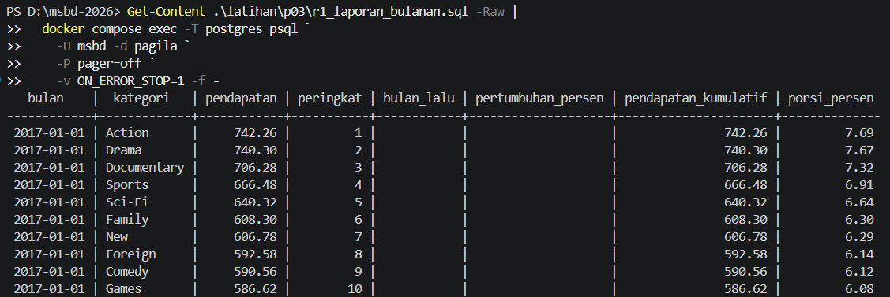

# Laporan Latihan Kelompok Pertemuan 3

## Anggota dan Kontribusi

| Nama | NIM | Kontribusi | Commit |
|---|---:|---|---|
| Mochamad Rizki Agiantoro | 251402135 | Isi kontribusi | Isi hash commit |
| Ramadiyan Athallah Kusuma | 251402027 | Isi kontribusi | Isi hash commit |
| Juda Benhur Turnip | 251402096 | Isi kontribusi | Isi hash commit |
| Dennis Pamungkas Panjaitan | 251402076 | Isi kontribusi | Isi hash commit |
| Daffa Umayans Saragih | 251402011 | Setup, Q1-Q9, dan bagian laporan terkait | Isi hash commit |

Catatan: Pengerjaan Langkah 1 hingga Langkah 4 diambil alih sementara di awal untuk memastikan proyek kelompok tetap berjalan lancar.

---

## Refleksi A - Subquery

Pertanyaan Pada Q4, apa tepatnya yang membuat NOT IN berbahaya, dan bagaimana memeriksa apakah sebuah kolom rawan terhadap masalah itu?

Penggunaan NOT IN sangat berbahaya jika subquery menghasilkan nilai NULL.
Seperti yang pernah bapak jelaskan dalam kelas kalau kita pakai not in maka nanti hasilnya malah unknown nah ini bahaya nanti filter not in malah gagal menampikan datanya  

Pertanyaan Pada Q5, berapa kali subquery dievaluasi secara konseptual, dan mengapa sekali per baris luar belum tentu sama dengan yang benar-benar dikerjakan mesin?

Secara konseptual, correlated subquery dievaluasi satu kali untuk setiap baris di query luar. Namun pada praktiknya, query optimizer pada database cukup pintar dan jarang mengeksekusi subquery dengan cara looping satu per satu. Mesin database biasanya mengubah bentuknya menjadi operasi JOIN atau hashing di balik layar agar waktu eksekusinya lebih efisien.

---

## Refleksi B - CTE dan Recursive CTE

Pertanyaan Pada Q7, mengapa recursive term hanya melihat baris yang baru dihasilkan pada iterasi sebelumnya, dan apa akibatnya jika ia melihat seluruh hasil?

Recursive term hanya melihat baris yang baru dihasilkan agar proses penelusuran hierarki bisa terus bergerak maju ke bawah. Ini menjadi tanda bagi sistem untuk berhenti bekerja saat iterasi tidak lagi menghasilkan baris baru. Jika query melihat seluruh hasil dari awal, rekursi akan memproses ulang data yang sama secara terus-menerus dan memicu infinite loop.

Pertanyaan Kapan mengganti UNION ALL dengan UNION dapat menghentikan siklus, dan mengapa itu tetap bukan solusi yang baik?

Mengganti UNION ALL dengan UNION bisa menghentikan siklus karena operasi UNION secara otomatis menghapus baris yang duplikat. Saat siklus memunculkan data yang berulang, data itu langsung dibuang sehingga rekursi berhenti. Tapi ini bukan solusi yang baik karena operasi UNION sangat membebani memori untuk proses sorting. Selain itu, cara ini berisiko menghilangkan data valid yang nilainya memang kebetulan sama.

---

## Refleksi C - Window Function
Pada Q14, `RANGE` memasukkan seluruh baris peer dengan nilai pengurutan yang sama, sedangkan `ROWS` menghitung berdasarkan posisi baris. Karena Q13 dan Q14 lebih dulu meringkas payment menjadi satu baris per tanggal, tanggalnya unik dan hasil kedua frame sama. Untuk laporan keuangan, frame `ROWS` eksplisit lebih aman karena maksud perhitungan per baris dinyatakan dengan jelas.

Pada Q15, menambahkan `ORDER BY` tanpa frame membuat PostgreSQL memakai frame default `RANGE ... CURRENT ROW`. Total yang seharusnya menjadi total seluruh pelanggan dapat berubah menjadi total berjalan. Karena itu query Q15 menuliskan frame sampai `UNBOUNDED FOLLOWING`.

## Refleksi D - Agregasi dan Operasi Himpunan
`GROUPING()` diperlukan untuk membedakan NULL yang dibuat oleh `ROLLUP` sebagai subtotal atau grand total dari NULL yang memang berasal dari data. Tanpa `GROUPING()`, kedua kondisi tersebut terlihat sama bagi pembaca.

`FILTER` dan `CASE WHEN` dapat berbeda jika CASE mengisi baris yang tidak memenuhi syarat dengan nilai seperti nol. Nilai tersebut ikut dihitung oleh agregat. Pada Q17, CASE tidak memiliki `ELSE`, sehingga menghasilkan NULL dan hasil rata-ratanya setara dengan versi `FILTER`.

## Refleksi E - JSONB
Nomor transaksi, status, jumlah, dan identitas pelanggan sebaiknya menjadi kolom relasional jika sering dipakai untuk pencarian, join, laporan, atau constraint. Nomor transaksi dapat diberi UNIQUE, status dapat diberi CHECK, jumlah dapat diberi tipe numerik, dan identitas pelanggan dapat diberi foreign key.

Data fleksibel seperti metadata tambahan dan array kontak masih sesuai disimpan dalam JSONB. Jika kontak mulai sering dicari, divalidasi, atau dihubungkan dengan tabel lain, array tersebut lebih tepat dipromosikan menjadi tabel relasional terpisah.

## Temuan Q14
Hasil perbandingan Q14 menunjukkan `jumlah_tanggal_berbeda = 0`. Hal ini terjadi karena CTE `harian` lebih dulu menggabungkan payment menjadi satu baris untuk setiap tanggal, sehingga tidak ada peer dengan nilai `tanggal` yang sama pada window. Dengan urutan tanggal yang unik, frame `ROWS` dan `RANGE` menghasilkan running total yang sama.

## Hasil R1

R1 berhasil dijalankan pada Pagila PostgreSQL 17 dan menghasilkan laporan pendapatan bulanan per kategori dengan pendapatan, peringkat, pendapatan bulan sebelumnya, pertumbuhan, kumulatif, dan porsi bulanan.

## Pemeriksaan Akhir
- PostgreSQL 17 dan Pagila berhasil diverifikasi.
- Q00 dapat dijalankan ulang untuk membuat tabel bantu.
- Q10-Q20 dan R1 sudah dijalankan dengan `ON_ERROR_STOP=1`.
- Q14 mencatat `jumlah_tanggal_berbeda = 0`.
- Screenshot sepuluh baris pertama R1 tersedia.
- Isi kontribusi dan hash commit anggota masih harus dilengkapi berdasarkan riwayat Git.

## Tautan Merge Request
[Isi tautan merge request di sini]
